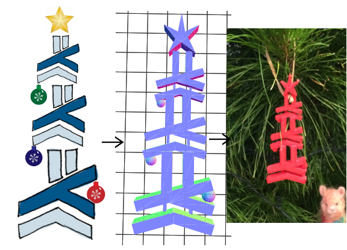
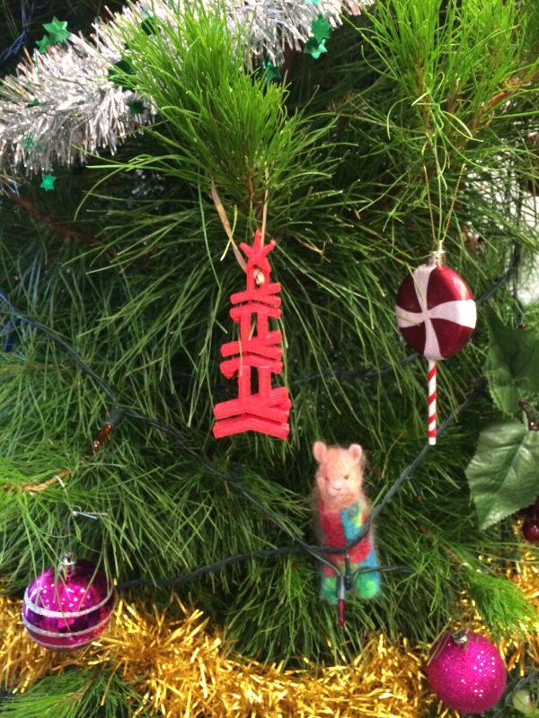

haskmas
==

A haskell-themed tree decoration written in haskell. Happy Haskmas!



[(In online viewer in GitHub) Haskmas in 3D](https://github.com/silky/haskmas/blob/master/haskmas.stl)

Original [Haskmass](http://www.meetup.com/Melbourne-Haskell-Users-Group/events/222203592/)
logo courtesty of [Lyndon](https://github.com/sordina).


usage/installation
==

- Build/run with [stack](https://github.com/commercialhaskell/stack).

````
stack build
stack exec haskmas
````

At the moment this outputs `haskmas.scad`, which you can feed into [OpenSCAD](http://www.openscad.org/) to get a rendering; from here you can export to STL.

I'm not using [ImplicitCAD](https://github.com/colah/ImplicitCAD)s STL output because it's a bit [inefficient](https://github.com/colah/ImplicitCAD/pull/67) at the moment.

- Print on a 3D printer
- Put it somewhere


